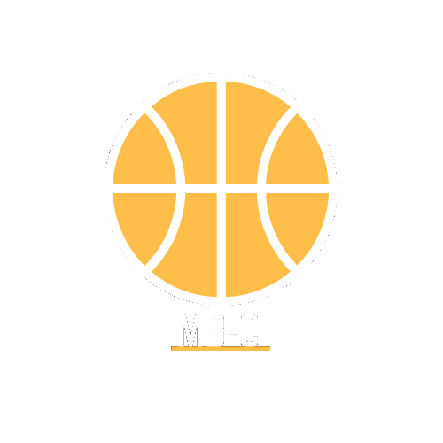
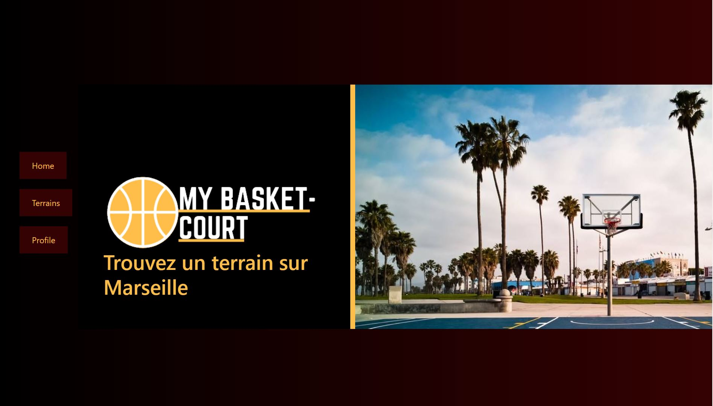

<p align="center">
  <a href="" rel="noopener">
 </a>
</p>

<h3 align="center">My Basket-Court</h3>

<div align="center">  


[]()
[](https://github.com/fedescode/The-Documentation-Compendium/pulls)
</div>

---

<p align="center"> Find the basket courts in Marseille.
    <br> 
</p>

## 📝 Table of Contents

- [About](#about)
- [Getting Started](#getting_started)
- [Built Using](#built_using)
- [Authors](#authors)

## 🧐 About <a name = "about"></a>

I start this project as a Web development project from my Web module in college. I wanted to create a simple web application that would be able to manage the basketball courts in Marseille


## 🏁 Getting Started <a name = "getting_started"></a>

These instructions will get you a copy of the project up and running on your local machine for development and testing purposes. See [deployment](#deployment) for notes on how to deploy the project on a live system.

### Prerequisites

What things you need to install the software and how to install them.

```
node js
sqlite
bootstrap

```

## ⛏️ Built Using <a name = "built_using"></a>

- [sqlite]() - Database
- [Express](https://expressjs.com/) - Server Framework
- [VueJs](https://vuejs.org/) - Web Framework
- [NodeJs](https://nodejs.org/en/) - Server Environment


## Images <a name="images"></a>

<p>

</p>


## ✍️ Authors <a name = "authors"></a>

- [@fedescode](https://github.com/fedescode) - Idea & Initial work